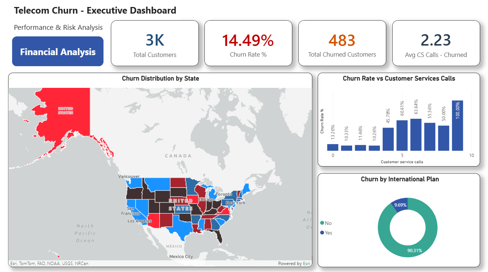
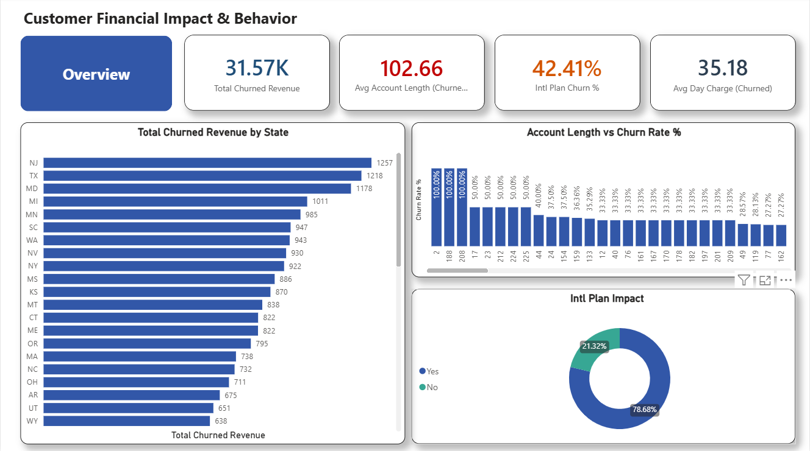

# Comprehensive Data Analytics & Machine Learning Portfolio

An end-to-end portfolio showcasing advanced data analysis, data cleaning, Exploratory Data Analysis (EDA), regression, clustering, classification models, sentiment analysis, and interactive dashboarding using Python and Power BI.

---

## 📂 Repository Structure

- **`data/`**: Contains raw and processed datasets (Telecom Churn, House Prices, etc.).
- **`notebooks/`**: Step-by-step Jupyter Notebooks categorized into 3 progressive levels:
  - **Level 1**: Data Cleaning & Advanced Exploratory Data Analysis (EDA).
  - **Level 2**: Predictive Regression & Unsupervised Clustering Models.
  - **Level 3**: Advanced Classification, Dashboard Integration, & Sentiment Analysis.
- **`dashboards/`**: Interactive Power BI dashboards (`.pbix`).

---

## 🛠️ Tech Stack & Libraries
- **Language**: Python 3.x
- **Data Manipulation & Analysis**: Pandas, NumPy
- **Machine Learning**: Scikit-Learn
- **Data Visualization**: Matplotlib, Seaborn, Power BI
- **Environment**: Jupyter Notebook / Google Colab

---
## 📊 Interactive Power BI Dashboard Preview

Here is a snapshot of the Power BI executive dashboard tracking key metrics and customer behavior:

